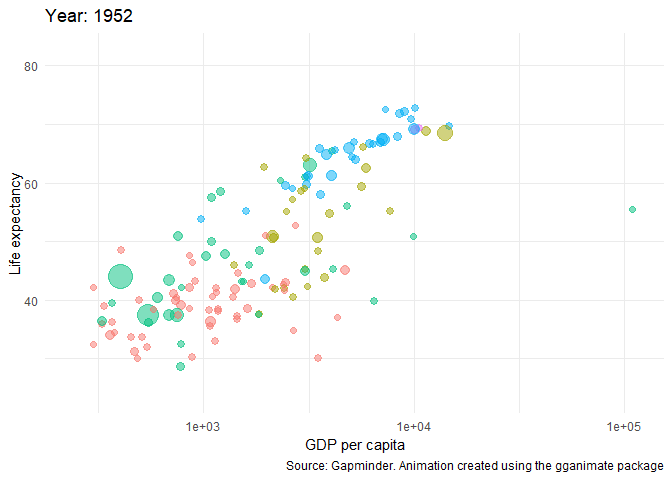

# Input

## Resources

-   You can find a cheatsheet for gganimate here: <https://rstudio.github.io/cheatsheets/gganimate.pdf>

-   And the package's vignette here: <https://gganimate.com/>

```{r, include=FALSE}
# Load packages
pacman::p_load("tidyverse", 
               "gapminder", 
               "gganimate")

# We store the gapminder dataset in the object gapminder
gapminder <- gapminder
```

## Animating the gapminder data set

In order to animate the gapminder dataset, we rely on the gganimate package. It allows us to easily create GIFs.

```{r, echo=TRUE}
# As usual we use our ggplot function and provide the data "gapminder"
gapminder_animated <- ggplot(gapminder, aes(x = gdpPercap, # GDP per capita on the x axis
                      y = lifeExp, # Life expectancy on the y-axis
                      colour = continent, # we color by continent
                      size = pop)) + # and adjust the size according to the population size
  geom_point(alpha = 0.5) + # make the points transparent
  scale_size(range = c(2, 12)) + # adjust the maximum size of the points
  scale_x_log10() + # transform the x-axis to a logarithmic one
  # rename axes, and create a caption
  labs(x = "GDP per capita", 
       y = "Life expectancy", 
       caption = "Source: Gapminder. Animation created using the gganimate package") +
  # using the minimal theme
  theme_minimal() +
  # ! here the magic comes into play: transition_time defines how our data is animted.
  # frame by frame per year
  transition_time(year) +
  # now we also give the plot a title: {frame_time} adapts to the frame's respective year
  labs(title = "Year: {frame_time}") +
  theme(legend.position = "none")

# here, we safe the animated object as a GIF
anim_save("animation_gapminder.gif", gapminder_animated)

# The expression "" outside the code chunk (below) inlcudes the GIF in the R Markdown document. We can do the same for .png or .jpeg files.
```


# Your turn

## Animating the gapminder data set with facets

How would you adapt the code to show the animation by continent?

```{r}

```


## Animation in flexdashboards

Can you include the GIF in your dashboard?


